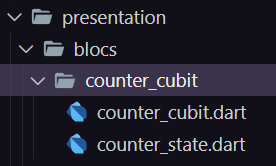
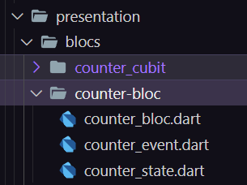

# Counter Blocs & Cubits & Forms 

Este proyecto desarrolla una aplicación de contador utilizando dos gestores de estado muy utilizados cuandoo se trabaja con Flutter: Blocs y Cubits. La idea es tratar de observar la misma funcionalidad en la aplicación con gestores de estado diferentes.

Por otra parte, también se implementa un formulario de registro con Cubits para poder visualizar el mismo comportamiento cuando las validaciones del mismo van modificando el estado.

## Cubits 📂

La forma de gestionar el estado de Cubits es creando en la capa de presentación el archivo **state.dart** donde se aloja el estado y el archivo **cubit.dart** donde se implementan los metodos que van a cambiar dicho estado. Después se llamará a dichos metodos en el screen asignado a ese bloc para mostrar las acciones en pantalla.

Estos archivos se pueden implementar automaticamente una vez se descarga la librería FlutterBlocs en las dependencias del proyecto y se van añadiendo carpetas de blocs en la capa de presentación del mismo.

## Blocs 📂

Blocs gestiona el estado de la misma forma que Cubits pero con la diferencia de que para cambiar el estado implementa en el archivo **event.dart** un disparador de eventos que registran los cambios en ese estado.

## Funcionalidad 🛠️
[cubit.bloc](https://github.com/jllanas1986/Flutter-Blocs-Cubits-Forms-app/assets/122029674/8a284e28-95c7-4e3a-931e-f8307ef048d4)

[form](https://github.com/jllanas1986/Flutter-Blocs-Cubits-Forms-app/assets/122029674/4500ab4b-d56d-4434-8bbd-0f7daf2d4e75)

## Recursos 📚

[udemy](https://www.udemy.com/)

## Autor ✒️

- **Jose Llanas** - [jllanas1986](https://github.com/jllanas1986)

